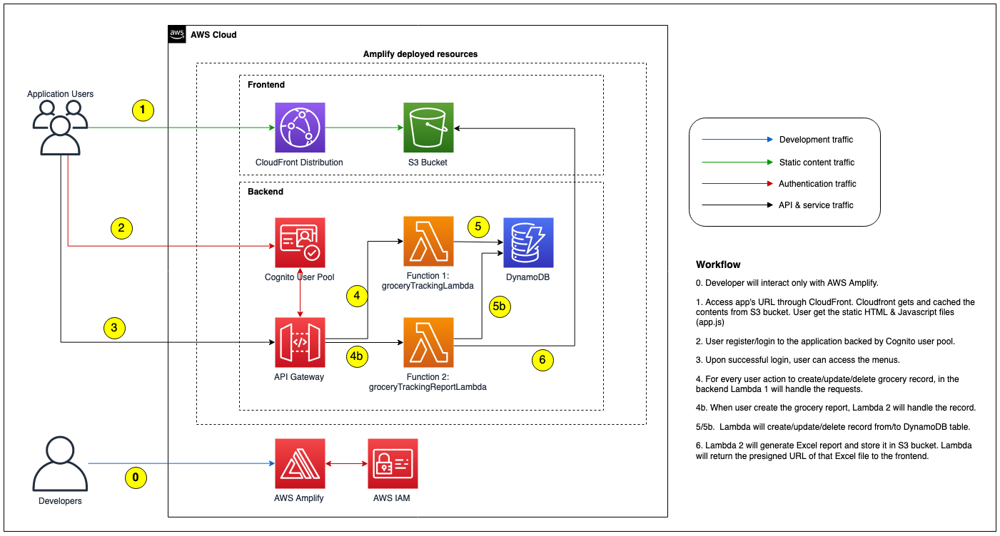
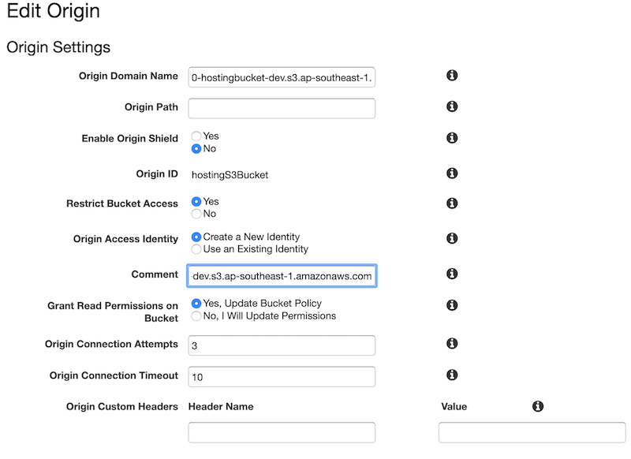

# Leap Day: Intro to AWS Amplify


## What we will build?

We will build the application that looks like the following diagram:



Details as follow:

1. Simple CRUD application to track grocery item (demo of the application can be seen [here](https://staticweb.awsbuilder.xyz/demo-react-app-amplify.mov))
    * CRUD = Create Read Update Delete
2. We will build both Frontend and Backend using AWS Amplify
    * Frontend : React JS (with Amplify library)
    * Backend : Python Lambda
3. The application will use following components:
    * DynamoDB 
    * API Gateway with Lambda as backend functions
    * Cognito User Pool
    * React JS application
    * Hosting in S3 & CloudFront

## Prerequisites

1. We will use Cloud9 with Amazon Linux 2 for the development setup. Please note that: 
   
    - You need to resize the disk to at least 20GB (Java script node modules will take up some spaces). You can use [automated script on Cloud9 user guide](https://docs.aws.amazon.com/cloud9/latest/user-guide/move-environment.html) to resize the disk on the fly.

2. Validate the following items in your Cloud9
    
    ```
    $ npm --version 
    $ npx --version
    $ yarn --version
    $ python --version
    $ pip --version
    $ pipenv --version
    $ amplify --version
    ```

    For you that don't familiar with command above: 

    - `npm` short for node package manager is a tool to install Javascript package.
    - `npx` is tool to execute Javascript package.
    - `yarn` is similar to npm. We will use yarn for the rest of the workshop, feel free to use npm if you more familiar with it.
    - `pip` is Python package manager to install required modules. 
    - `pipenv` is Python tool to create isolated environment & manage required packages inside it. We will use this when creating Lambda function.

3. On default Cloud9 installation you should have `npm`, `npx`, `python`, and `pip` (at the time of this writting, Amazon Linux 2 use Python 3.7.9 as default). And it is ok if you find error for `yarn`, `pipenv`, and `amplify`. On the next few steps we will configure those items.

4. You can skip this step if you already have `yarn` on your environment. Install YARN package manager

    ```
    $ npm install yarn -g
    $ yarn —version
    ```

5. At this time of this writting, Amplify requires Python 3.8 when we use Python for Lambda as backend. On Amazon Linux 2, Python 3.8 is available in Amazon Linux Extra. Run the following command to install Python 3.8.

    ```
    $ sudo yum update -y
    $ amazon-linux-extras list | grep -i python
    $ sudo amazon-linux-extras install python3.8 -y
    $ sudo alternatives --install /usr/bin/python3 python3 /usr/bin/python3.8 1
    $ sudo alternatives --config python3
    $ python3 --version
    ```

6. We need to install `pipenv` to create package dependencies list (`Pipfile`) for Lambda Python.

    ```
    $ python3 -m pip install --user pipenv
    ```

7. Last but not least, we need to install Amplify CLI using the following command:

    ```
    $ npm install -g @aws-amplify/cli
    ```

    We will use Amplify CLI to create, configure and provision all AWS resources.

8. Download the file below and extract:

    ```
    $ wget https://staticweb.awsbuilder.xyz/leapdemo-introamplify-workshop.tar.gz
    $ tar zxvf leapdemo-introamplify-workshop.tar.gz
    ```

    You should see 4 files below, we will use those files later in the installation steps:

    - groceryTrackingLambda.tar.gz
    - groceryTrackingReportLambda.tar.gz
    - react-app.tar.gz
    - index.html

## Installation

1. First we will create a basic React App. We create a folder as project folder and run `npx create-react-app` as shown below:

    ```
    $ mkdir leapdemo
    $ cd leapdemo
    $ npx create-react-app .
    ```

    On the example above, we use `leapdemo` folder as top level project. You can use different project folder name.

2. We can test basic React website locally using the following command:

    ```
    $ yarn start
    ```

    By default `yarn` will create local web server using port 8080.

3. You can check the output using Preview button on the Cloud9 top navbar, you should see the output similar like this:

    

    Alternatively you can test from your local browser after you add the required port in Cloud9's security group setting.

4. Lets inspect the working directory, you should have the following contents :

    ```
    $ ls -trl
    total 548
    drwxrwxr-x    2 ec2-user ec2-user   4096 Dec  4 15:20 src
    -rw-r--r--    1 ec2-user ec2-user   3362 Dec  4 15:20 README.md
    drwxrwxr-x    2 ec2-user ec2-user   4096 Dec  4 15:20 public
    -rw-rw-r--    1 ec2-user ec2-user    812 Dec  4 15:20 package.json
    -rw-rw-r--    1 ec2-user ec2-user 503731 Dec  4 15:20 yarn.lock
    drwxrwxr-x 1048 ec2-user ec2-user  36864 Dec  4 15:22 node_modules
    $ 
    ```

    - `src` folder is the placeholder for our React source codes.
    - `package.json` contains all Javascript package dependencies and some command to build & run this React application.
    - `public` is the folder that will be accessed by web user, contains `index.html` & Javascript for React application. 
    <!-- To be validated -->

5. Now lets setup Amplify by initialize the environment using command below (still on top level project directory):

    ```
    $ amplify init
    ```

    Amplify will as you to provide some information below : 

    ```
    ? Enter a name for the project    # Your project name (e.g. leapdemo)
    ? Enter a name for the environment    # Your environment type (e.g. dev /prod)
    ? Choose your default editor:    # Your prefered editor (e.g. Visual Code Editor, this is optional)
    ? Choose the type of app that you're building    # Select javascript
    Please tell us about your project
    ? What javascript framework are you using    # Select react
    ? Source Directory Path:  src    # leave default value
    ? Distribution Directory Path: build    # leave default value
    ? Build Command:  npm run-script build    # leave default value
    ? Start Command: npm run-script start    # leave default value
    Using default provider  awscloudformation    # leave default value
    AWS access credentials can not be found.  #
    ? Setup new user Yes    # Select Yes if you want to create new IAM user
    Follow these steps to set up access to your AWS account:

    Sign in to your AWS administrator account:
    https://console.aws.amazon.com/
    Press Enter to continue

    Specify the AWS Region
    ? region:    # Specify AWS region
    Specify the username of the new IAM user:
    ? user name:     # Specify IAM User
    Complete the user creation using the AWS console
    https://console.aws.amazon.com/iam/home?region=ap-southeast-1#/users$new?step=final&accessKey&userNames=amplify-leapdemo&permissionType=policies&policies=arn:aws:iam::aws:policy%2FAdministratorAccess
    Press Enter to continue

    Enter the access key of the newly created user:
    ? accessKeyId:  ********************    # Input your access key id
    ? secretAccessKey:  ****************************************    # Input your secret access key
    This would update/create the AWS Profile in your local machine
    ? Profile Name:    # leave default or input AWS profile name if you have existing AWS profile in your Cloud9

    Successfully set up the new user.

    For more information on AWS Profiles, see:
    https://docs.aws.amazon.com/cli/latest/userguide/cli-configure-profiles.html

    ? Do you want to use an AWS profile?    # Select Yes to use profile
    ? Please choose the profile you want to use    # Select AWS Profile name
    ```

    After all those questionaire, Amplify will start to initialize a new Amplify environment in the backend.

    Please note that IAM user creation is optional step, you can rather use existing IAM and/or existing AWS profile. Default user created from this console will be using `AdministratorAccess` policy.

6. We can validate the status of Amplify using `amplify status` command. At the moment you should see empty Resource name.

7. Next we will create Cognito user pool for handling our application user authentication. Run the following command to start adding & configuring Cognito:

    ```
    $ amplify add auth
    ```

    By default Amplify will use Cognito as provider as mentioned in the initial message:

    ```
    Using service: Cognito, provided by: awscloudformation
    
    The current configured provider is Amazon Cognito. 
    ```

    Amplify will ask few configuration below:

    ```
    Do you want to use the default authentication and security configuration?    # Choose "Default configuration"
    How do you want users to be able to sign in?    # Choose "Username"
    Do you want to configure advanced settings?    # Choose "No, I am done."
    ```

    Notes :

    1. That you can choose different setup if you already comfortable with Cognito settings.
    2. To navigate through Amplify resource creation wizard, you can use :
        - up/down arrow buttons
        - 'space' button to select 1 option
        - 'a' button to select all options
        - 'i' button to invert the selection
        - 'Enter' button to continue

8. Next we need to create S3 bucket as the storage media using the following command: 

    ```
    amplify add storage
    ```

    Amplify will ask few configuration below:

    ```
    ? Please select from one of the below mentioned services:    # Select "Content (Images, audio, video, etc.)"
    ? Please provide a friendly name for your resource that will be used to label this category in the project:    # Specify resource name, e.g. grocerybucket
    ? Please provide bucket name:    # Specify S3 bucket name (must be unique), e.g. grocerybucket123
    ? Who should have access:    # Select "Auth users only"
    ? What kind of access do you want for Authenticated users?    # Select "create/update, read, delete"
    ? Do you want to add a Lambda Trigger for your S3 Bucket?    # Select "No"
    ```

9. Next we need to prepare DynamoDB table. Please note that for this step you must follow the instruction below closely (using the same column name, column type, as well as Primary/Sort Key setup) since the Lambda function already set using those values.

    ```
    $ amplify add storage
    ? Please select from one of the below mentioned services:    # Select "NoSQL Database"

    Welcome to the NoSQL DynamoDB database wizard
    This wizard asks you a series of questions to help determine how to set up your NoSQL database table.

    ? Please provide a friendly name for your resource that will be used to label this category in the project:    # Specify Amplify resource name, e.g. "groceryTable"
    ? Please provide table name:    # Specify Amplify resource name, e.g. "groceryTable"

    You can now add columns to the table.

    ? What would you like to name this column: PK
    ? Please choose the data type: string
    ? Would you like to add another column? Yes
    ? What would you like to name this column: SK
    ? Please choose the data type: string
    ? Would you like to add another column? Yes
    ? What would you like to name this column: username
    ? Please choose the data type: string
    ? Would you like to add another column? Yes
    ? What would you like to name this column: grocery_id
    ? Please choose the data type: string
    ? Would you like to add another column? Yes
    ? What would you like to name this column: grocery_date
    ? Please choose the data type: string
    ? Would you like to add another column? Yes
    ? What would you like to name this column: grocery_budget
    ? Please choose the data type: string
    ? Would you like to add another column? Yes
    ? What would you like to name this column: grocery_name
    ? Please choose the data type: string
    ? Would you like to add another column? Yes
    ? What would you like to name this column: grocery_cost
    ? Please choose the data type: string
    ? Would you like to add another column? Yes
    ? What would you like to name this column: grocery_qty
    ? Please choose the data type: string
    ? Would you like to add another column? No
 
    ? Please choose partition key for the table: PK
    ? Do you want to add a sort key to your table? Yes
    ? Please choose sort key for the table: SK

    ? Do you want to add global secondary indexes to your table? No
    ? Do you want to add a Lambda Trigger for your Table? No
    Successfully added resource groceryTable locally 
    ```

10. The next step is to create API Gateway (REST)  with Lambda functions as backend:

    ```
    $ amplify add api
    ? Please select from one of the below mentioned services:    # Select "REST"
    ? Provide a friendly name for your resource to be used as a label for this category in the project:    # Specify API name, e.g. "groceryTrackingAPI"
    ? Provide a path (e.g., /book/{isbn}):    # Specify 1st path name for CRUD operation, e.g. "/grocery"
    ? Choose a Lambda source    # Select "Create a new Lambda function"
    ? Provide an AWS Lambda function name:    # Specify Lambda name, e.g. "groceryTrackingLambda"
    ? Choose the runtime that you want to use:    # Select "Python"
    ? Do you want to configure advanced settings?    # Select "Yes"
    ? Do you want to access other resources in this project from your Lambda function?    # Select "Yes"
    ? Select the category    # Select "storage"
    ? Storage has 2 resources in this project. Select the one you would like your Lambda to access    # Select both DynamoDB table & S3 Bucket name, e.g. "groceryBucket, groceryTable"
    ? Select the operations you want to permit for groceryBucket    # Select "create, read, update, delete"
    ? Select the operations you want to permit for groceryTable    # Select "create, read, update, delete"

    # Note the output of these environment variables name
    You can access the following resource attributes as environment variables from your Lambda function
            ENV
            REGION
            STORAGE_GROCERYBUCKET_BUCKETNAME
            STORAGE_GROCERYTABLE_ARN
            STORAGE_GROCERYTABLE_NAME

    ? Do you want to invoke this function on a recurring schedule?    # Select "No"
    ? Do you want to configure Lambda layers for this function?    # Select "No"
    ? Do you want to edit the local lambda function now?    # Select "No"
    ? Restrict API access    # Select "Yes"
    ? Who should have access?    # Select "Authenticated users only"
    ? What kind of access do you want for Authenticated users?    # Select "create, read, update, delete"
    ? Do you want to add another path?    # Select "Yes"

    ? Provide a path (e.g., /book/{isbn}):    # Specify 1st path name for reporting function, e.g. "/report"
    ? Choose a Lambda source    # Select "Create a new Lambda function"
    ? Provide an AWS Lambda function name:    # Specify Lambda name, e.g. "groceryTrackingReportLambda"
    ? Choose the runtime that you want to use:    # Select "Python"
    ? Do you want to configure advanced settings?    # Select "Yes"
    ? Do you want to access other resources in this project from your Lambda function?    # Select "Yes"
    ? Select the category    # Select "storage"
    ? Storage has 2 resources in this project. Select the one you would like your Lambda to access    # Select DynamoDB table & S3 Bucket name, e.g. "groceryBucket, groceryTable"
    ? Select the operations you want to permit for groceryBucket    # Select "create, read, update, delete"
    ? Select the operations you want to permit for groceryTable    # Select "create, read, update, delete"

    # Note the output of these environment variables name
    You can access the following resource attributes as environment variables from your Lambda function
            ENV
            REGION
            STORAGE_GROCERYBUCKET_BUCKETNAME
            STORAGE_GROCERYTABLE_ARN
            STORAGE_GROCERYTABLE_NAME

    ? Do you want to invoke this function on a recurring schedule?    # Select "No"
    ? Do you want to configure Lambda layers for this function?    # Select "No"
    ? Do you want to edit the local lambda function now?    # Select "No"
    ? Restrict API access    # Select "Yes"
    ? Who should have access?    # Select "Authenticated users only"
    ? What kind of access do you want for Authenticated users?    # Select "create, read, update, delete"
    ? Do you want to add another path?    # Select "No" 
    ```

11. We need to prepare React environment variables based on the values we used on previous steps. On the top project folder, create `.env` file and add the following parameters:

    ```
    REACT_APP_API_NAME=groceryTrackingAPI
    REACT_APP_API_PATH=/grocery
    REACT_APP_API_PATH_REPORT=/report
    ```

12. Now we can copy all the source codes (Python for Lambda function and all React apps) from the zip files provided earlier:

    - Go to 1st Lambda function folder under `<PROJECT_FOLDER>/amplify/backend/function/<FUNCTION_1>/src` and extract `groceryTrackingLambda.tar.gz` (in this sample it is `leapdemo/amplify/backend/function/groceryTrackingLambda/src`), you should see the following files:

        1. createItem.py 
        2. deleteItem.py 
        3. getItem.py 
        4. index.py  (overwrite existing index.py)
        5. updateItem.py 
        6. validateRequest.py
        7. event.json

    - Go to 2nd Lambda function folder under `<PROJECT_FOLDER>/amplify/backend/function/<FUNCTION_2>/src` (in this sample it is leapdemo/amplify/backend/function/groceryTrackingReportLambda/src) and extract `groceryTrackingReportLambda.tar.gz`, you should see 2 files below:

        1. createReport.py
        2. index.py (overwrite existing file)

    - Now go back to the React `src` folder which located under root project directory and extract `react-app.tar.gz`. You should get 15 files below:

        1. alertHelper.js
        2. App.css (override existing)
        3. App.js (override existing)
        4. dateHelper.js
        5. Header.css
        6. Header.js
        7. Home.js
        8. index.css (override existing)
        9. index.js (override existing)
        10. NewGrocery.js
        11. Report.js
        12. ShowAll.js
        13. ShowByDate.js
        14. ShowDetail.js
        15. tableHandlerNew.js

    - Go to `public` folder under root project directory and overwrite `index.html` using the file you downloaded earlier.

13. Our sample React App requires some Node modules, go to top project directory and install the required modules using the following command:

    ```
    $ yarn add @aws-amplify/ui-react \
        query-string \
        aws-amplify \
        react-bootstrap \
        react-datepicker \
        react-number-format \
        react-router-dom \
        styled-components \
        uuid;
    ```

14. Next we to add Python package dependencies for both Lambda function. We will use `pipenv` command to install and list the required packages:

    - First Lambda function (i.e. `groceryTrackingLambda`) requires `boto3` to interact with other AWS resources (such as DynamoDB), and also `datetime` package to manage the timestamp. Go to 1st Lambda function folder under `<PROJECT_FOLDER>/amplify/backend/function/<FUNCTION_1>` and run the following command:

        ```
        $ pipenv install boto3 datetime 
        ```

        The `pipenv` command will install the required packages in isolated Python environment & write the packages name into the `Pipfile` file. In the same directory (`<PROJECT_FOLDER>/amplify/backend/function/<FUNCTION_1>`), check the `Pipfile` & verify it already contains both packages like the example below:

        ```
        $ cat Pipfile
        [[source]]
        name = "pypi"
        url = "https://pypi.org/simple"
        verify_ssl = true

        [dev-packages]

        [packages]
        boto3 = "*"
        datetime = "*"

        [requires]
        python_version = "3.8"        
        ```

    - Second Lambda function (i.e. `groceryTrackingReportLambda`) requires few Python packages:

        1. `boto3`: to interact with DynamoDB table
        2. `datetime`: to handle timestamp & date formatting 
        3. `pandas` & `numpy`: to build the data set in Excel format.
        4. `xlsxwriter`: to produce Excel report file.

        Go to 2nd Lambda function folder under `<PROJECT_FOLDER>/amplify/backend/function/<FUNCTION_2>` and and run the following command:

        ```
        $ pipenv install boto3 datetime numpy pandas xlsxwriter
        ```
        
        Same as previous step, check the `Pipfile` file & verify it already contains all packages like the example below:

        ```
        $ cat Pipfile
        [[source]]
        name = "pypi"
        url = "https://pypi.org/simple"
        verify_ssl = true
        
        [dev-packages]
        
        [packages]
        numpy = "*"
        pandas = "*"
        xlsxwriter = "*"
        boto3 = "*"
        datetime = "*"
        
        [requires]
        python_version = "3.8"        
        ```


15. Up until this point all configuration of backend components still not pushed to the cloud. You should see similar output below:

    ```
    $ amplify status

    Current Environment: dev

    | Category | Resource name                | Operation | Provider plugin   |
    | -------- | ---------------------------- | --------- | ----------------- |
    | Auth     | leapdemo8ff38349             | Create    | awscloudformation |
    | Storage  | groceryBucket                | Create    | awscloudformation |
    | Storage  | groceryTable                 | Create    | awscloudformation |
    | Function | groceryTrackingLambda        | Create    | awscloudformation |
    | Function | grocertyTrackingReportLambda | Create    | awscloudformation |
    | Api      | groceryTrackingAPI           | Create    | awscloudformation |

    $ 
    ```

16. Now we can push the configuration, Amplify will start provision all of the backend resources using bunch of CloudFormation scripts.

    ```
    $ amplify push -y
    ```
    This process will take some time to complete (15-25minutes). In the end if all resources has been provisioned successfully, you should see the output like this:

    ```
    ✔ All resources are updated in the cloud

    REST API endpoint: https://br1670h4e4.execute-api.ap-southeast-1.amazonaws.com/dev

    $ 
    ```

    We can double check the status using `amplify status` command.

17. Now we can continue build and publish the frontend component (i.e. publish React app). Amplify provides 2 method to host our React app:

    1. Hosting with Amplify Console
    2. CloudFront & S3

    In this workshop we will use CloudFront and S3. To configure the hosting, run the following command:

    ```
    $ amplify add hosting
    ? Select the plugin module to execute   # Select Amazon CloudFront and S3
    ? Select the environment setup:     # Select PROD (S3 with CloudFront using HTTPS)
    ? hosting bucket name     # leave default value for bucket name

    Static webhosting is disabled for the hosting bucket when CloudFront Distribution is enabled.

    You can now publish your app using the following command:
    Command: amplify publish

    $
    ```

18. Execute `amplify publish` to continue setup S3 & CloudFront. What happen next is Amplify will do the following:

    - Create new S3 bucket for application hosting
    - Create a new CloudFront distribution with S3 as backend. 
    - On the CloudFront distribution, a new Origin Access Identity (OAI) will be created to restrict access directly to S3 bucket. A corresponding S3 bucket policy also configured to allow the new OAI.
    - Amplify will make sure all configured resources already push and provisioned in the cloud.
    - Amplify will build React source code (execute `react-scripts build` described in `package.json` file) and upload the artifact to the S3 bucket.

    At the end of the process, you will see the notification like the sample below:

    ```
    Your app is published successfully.
    https://d3ljobzzmaed3j.cloudfront.net
    ```

19. Once caveat if we use region other than `us-east-1` is CloudFront falsely redirect the request to S3 bucket like the following example.

    ```
    $ curl -I https://d3ljobzzmaed3j.cloudfront.net
    HTTP/2 307
    content-type: application/xml
    location: https://leapdemo-20210115111810-hostingbucket-dev.s3-ap-southeast-1.amazonaws.com/index.html
    x-amz-bucket-region: ap-southeast-1
    date: Fri, 15 Jan 2021 11:28:18 GMT
    server: AmazonS3
    x-cache: Miss from cloudfront
    via: 1.1 f28347a3148f4f8fa1d930375689073d.cloudfront.net (CloudFront)
    x-amz-cf-pop: SIN5-C1
    x-amz-cf-id: 6UNRO-nJlIQcIMp1xz0b_Kv-dVQb9Mn3yvRepLlk1IMqx7HHJfjoZA==

    $
    ```

    This behaviour occur because delay on DNS propagation of our our newly created S3 bucket. It will not be an issue if we configure our Amplify in `us-east-1`. You can wait until the propagation completed or as the workaround we can modify CloudFront origin to point to regional name of S3 bucket as shown below:

    - Before: <hosting_bucket_name>.s3.amazonaws.com
    - After: <hosting_bucket_name>.s3.<aws_region>.amazonaws.com

    Don't forget to recreate OAI & update S3 bucket policy when we change the origin name as shown in the following screenshot:

    

20. After CloudFront configuration updated, you can test visiting its domain name once again.

    

21. You can test the application by signing up first.

## Known Issue

We acknowledge the issue with Excel report generation if you are using Python 3.8.5. When we push the environment, Amplify only compiled 3 packages (`boto3`, `datetime`, and `xlsxwriter`). That makes Lambda report function generate the following error:

```
[ERROR] Runtime.ImportModuleError: Unable to import module 'index': No module named 'pandas'
```

Upon checking we found that with Python 3.8.5 there is different location of packages, both `numpy` & `pandas` now stored inside `lib64`

```
:~/.local/share/virtualenvs/groceryTrackingReportLambda-W_sVNa5j $ ll lib64/python3.8/site-packages/
total 8
drwxrwxr-x 17 ec2-user ec2-user 4096 Jan 15 10:56 numpy
drwxrwxr-x  2 ec2-user ec2-user  175 Jan 15 10:56 numpy-1.19.5.dist-info
drwxrwxr-x  2 ec2-user ec2-user  150 Jan 15 10:56 numpy.libs
drwxrwxr-x 15 ec2-user ec2-user  296 Jan 15 10:56 pandas
drwxrwxr-x  2 ec2-user ec2-user  161 Jan 15 10:56 pandas-1.2.0.dist-info
drwxrwxr-x  3 ec2-user ec2-user   23 Jan 15 10:56 zope
-rw-rw-r--  1 ec2-user ec2-user  529 Jan 15 10:56 zope.interface-5.2.0-py3.8-nspkg.pth
drwxrwxr-x  2 ec2-user ec2-user  136 Jan 15 10:56 zope.interface-5.2.0.dist-info
:~/.local/share/virtualenvs/groceryTrackingReportLambda-W_sVNa5j $
```

While the other 3 packages are stored in `lib` folder:

```
:~/.local/share/virtualenvs/groceryTrackingReportLambda-W_sVNa5j $ ll lib/python3.8/site-packages/
total 76
drwxrwxr-x  4 ec2-user ec2-user   156 Jan 15 10:56 DateTime
drwxrwxr-x  2 ec2-user ec2-user   148 Jan 15 10:56 DateTime-4.3.dist-info
drwxrwxr-x  2 ec2-user ec2-user   123 Jan 15 10:57 XlsxWriter-1.3.7.dist-info
drwxrwxr-x  2 ec2-user ec2-user    32 Jan 15 10:56 __pycache__
drwxrwxr-x  2 ec2-user ec2-user    44 Jan 15 10:56 _distutils_hack
-rw-rw-r--  1 ec2-user ec2-user    18 Jan 15 10:56 _virtualenv.pth
-rw-rw-r--  1 ec2-user ec2-user  5662 Jan 15 10:56 _virtualenv.py
drwxrwxr-x 10 ec2-user ec2-user   210 Jan 15 10:56 boto3
drwxrwxr-x  2 ec2-user ec2-user   148 Jan 15 10:56 boto3-1.16.55.dist-info
drwxrwxr-x  7 ec2-user ec2-user  4096 Jan 15 10:56 botocore
drwxrwxr-x  2 ec2-user ec2-user   131 Jan 15 10:56 botocore-1.19.55.dist-info
drwxrwxr-x  6 ec2-user ec2-user   210 Jan 15 10:56 dateutil
-rw-rw-r--  1 ec2-user ec2-user   152 Jan 15 10:56 distutils-precedence.pth
-rw-rw-r--  1 ec2-user ec2-user   126 Jan 15 10:56 easy_install.py
drwxrwxr-x  3 ec2-user ec2-user   167 Jan 15 10:56 jmespath
drwxrwxr-x  2 ec2-user ec2-user   150 Jan 15 10:56 jmespath-0.10.0.dist-info
drwxrwxr-x 17 ec2-user ec2-user  4096 Jan 15 13:40 numpy
drwxrwxr-x  2 ec2-user ec2-user   175 Jan 15 13:40 numpy-1.19.5.dist-info
drwxrwxr-x  2 ec2-user ec2-user   150 Jan 15 13:40 numpy.libs
drwxrwxr-x 15 ec2-user ec2-user   296 Jan 15 13:40 pandas
drwxrwxr-x  2 ec2-user ec2-user   161 Jan 15 13:40 pandas-1.2.0.dist-info
drwxrwxr-x  4 ec2-user ec2-user    76 Jan 15 10:56 pip
drwxrwxr-x  2 ec2-user ec2-user   130 Jan 15 10:56 pip-20.3.3.dist-info
-rw-rw-r--  1 ec2-user ec2-user     0 Jan 15 10:56 pip-20.3.3.virtualenv
drwxrwxr-x  4 ec2-user ec2-user    54 Jan 15 10:56 pkg_resources
drwxrwxr-x  2 ec2-user ec2-user   118 Jan 15 10:56 python_dateutil-2.8.1.dist-info
drwxrwxr-x  4 ec2-user ec2-user   150 Jan 15 10:56 pytz
drwxrwxr-x  2 ec2-user ec2-user   166 Jan 15 10:56 pytz-2020.5.dist-info
drwxrwxr-x  3 ec2-user ec2-user   304 Jan 15 10:56 s3transfer
drwxrwxr-x  2 ec2-user ec2-user   131 Jan 15 10:56 s3transfer-0.3.4.dist-info
drwxrwxr-x  6 ec2-user ec2-user  4096 Jan 15 10:56 setuptools
drwxrwxr-x  2 ec2-user ec2-user   154 Jan 15 10:56 setuptools-51.1.2.dist-info
-rw-rw-r--  1 ec2-user ec2-user     0 Jan 15 10:56 setuptools-51.1.2.virtualenv
drwxrwxr-x  2 ec2-user ec2-user   102 Jan 15 10:56 six-1.15.0.dist-info
-rw-rw-r--  1 ec2-user ec2-user 34159 Jan 15 10:56 six.py
drwxrwxr-x  6 ec2-user ec2-user   291 Jan 15 10:56 urllib3
drwxrwxr-x  2 ec2-user ec2-user   106 Jan 15 10:56 urllib3-1.26.2.dist-info
drwxrwxr-x  4 ec2-user ec2-user   190 Jan 15 10:56 wheel
drwxrwxr-x  2 ec2-user ec2-user   130 Jan 15 10:56 wheel-0.36.2.dist-info
-rw-rw-r--  1 ec2-user ec2-user     0 Jan 15 10:56 wheel-0.36.2.virtualenv
drwxrwxr-x  3 ec2-user ec2-user  4096 Jan 15 10:57 xlsxwriter
drwxrwxr-x  3 ec2-user ec2-user    23 Jan 15 13:40 zope
-rw-rw-r--  1 ec2-user ec2-user   529 Jan 15 13:40 zope.interface-5.2.0-py3.8-nspkg.pth
drwxrwxr-x  2 ec2-user ec2-user   136 Jan 15 13:40 zope.interface-5.2.0.dist-info
:~/.local/share/virtualenvs/groceryTrackingReportLambda-W_sVNa5j $
```

This is different behavior with Python 3.8.1 on which all packages stored in the same `lib` directory.

As the workaround, we can manually copied both `numpy` & `pandas` from `lib64` to `lib` folder. Steps are:

```
$ cp -r ~/.local/share/virtualenvs/groceryTrackingReportLambda*/lib64/python3.8/site-packages/numpy*  ~/.local/share/virtualenvs/groceryTrackingReportLambda*/lib/python3.8/site-packages/
$ cp -r ~/.local/share/virtualenvs/groceryTrackingReportLambda*/lib64/python3.8/site-packages/pandas*  ~/.local/share/virtualenvs/groceryTrackingReportLambda*/lib/python3.8/site-packages/
$ cd <PROJECT_FOLDER>/amplify/backend/function/<FUNCTION_2>
$ touch dummy.txt  ## this is to trick Amplify that there is actual function changes, otherwise it won't let us to run amplify push again.
$ amplify push -y
```

After that you can retest the application.


[Setup](setup.md)
